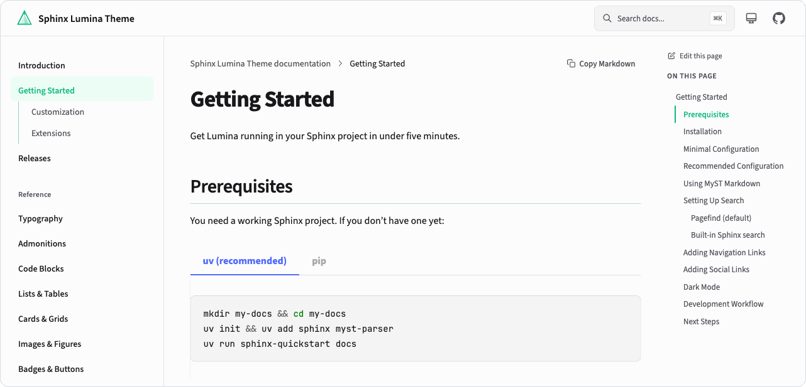

# Sphinx Lumina Theme

[](https://pypi.org/project/sphinx-lumina-theme/)
[](https://pypi.org/project/sphinx-lumina-theme/)
[](https://github.com/r4sky0/sphinx-lumina-theme/blob/main/LICENSE)
[](https://r4sky0.github.io/sphinx-lumina-theme/)

A modern Sphinx theme that treats documentation as a first-class product experience. Clean typography, responsive layout, dark mode, and instant search — out of the box.

<a href="https://r4sky0.github.io/sphinx-lumina-theme/">
  
</a>

<p align="center">
  <a href="https://r4sky0.github.io/sphinx-lumina-theme/"><strong>Documentation</strong></a> · <a href="https://r4sky0.github.io/sphinx-lumina-theme/getting-started.html"><strong>Getting Started</strong></a> · <a href="https://r4sky0.github.io/sphinx-lumina-theme/customization.html"><strong>Customization</strong></a>
</p>

## Features

- **Dark mode** — follows system preference with manual toggle, no flash of unstyled content
- **Instant search** — Pagefind-powered search with keyboard navigation (`⌘K`)
- **Responsive layout** — mobile-first with collapsible sidebar and sticky table of contents
- **MyST Markdown** — write docs in Markdown with full Sphinx directive support
- **Code blocks** — syntax highlighting with one-click copy
- **Self-hosted fonts** — Source Sans 3 and JetBrains Mono, no external CDN calls
- **Customizable** — accent colors, navigation links, social links, and more via `conf.py`

## Quick Start

Requires **Python 3.10+** and **Sphinx 8.0+**.

```bash
uv add sphinx-lumina-theme
```

Set the theme in your `conf.py`:

```python
html_theme = "lumina"
```

Build your docs:

```bash
uv run sphinx-build docs docs/_build/html
```

That's it. For pip, MyST Markdown setup, and configuration options, see the [Getting Started](https://r4sky0.github.io/sphinx-lumina-theme/getting-started.html) guide.

## Configuration

All options go in `html_theme_options` in your `conf.py`. Every option has a sensible default — you only need to set what you want to change.

```python
html_theme_options = {
    "accent_color": "#10b981",
    "dark_mode_default": "auto",       # "auto", "light", or "dark"
    "nav_links": "Guide=/guide, API=/api",
    "source_repository": "https://github.com/you/your-repo",
    "social_links": "github=https://github.com/you",
}
```

See the full [Customization](https://r4sky0.github.io/sphinx-lumina-theme/customization.html) reference for all available options.

## Development

```bash
git clone https://github.com/r4sky0/sphinx-lumina-theme.git
cd sphinx-lumina-theme
pnpm install        # JS dependencies
uv sync --extra dev # Python dependencies
pnpm run build      # Build CSS + JS assets
uv run pytest       # Run tests
```

## License

[MIT](LICENSE)
